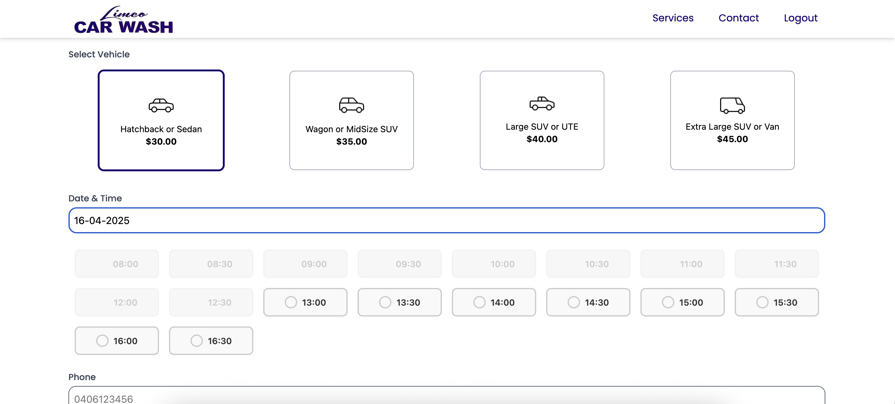
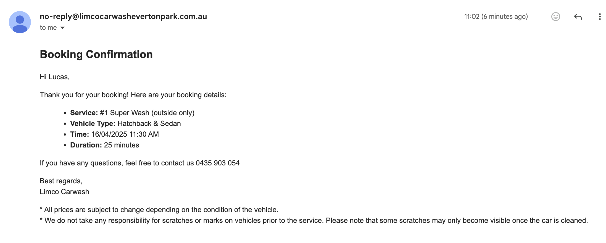
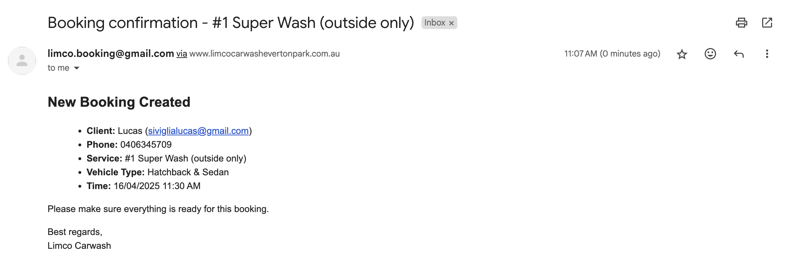
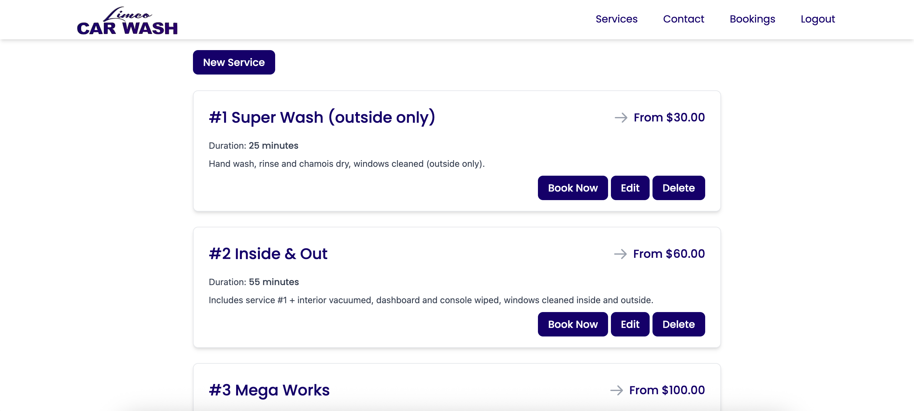
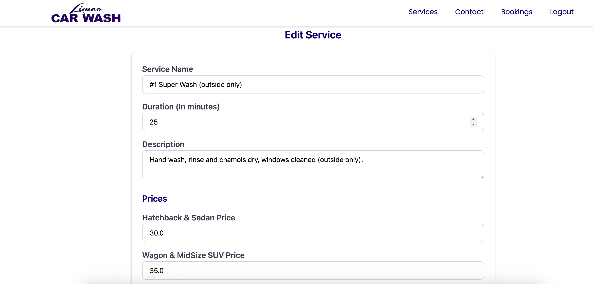

# Limco Car Wash

### Booking Page

### Booking Confirmation

### Booking Confirmation

### Edit Prices Admin Page

### Edit Prices Admin Page

**Freelance work** to develop a website for Limco Car Wash, featuring an integrated booking system for their services and enhancing their online presence.

Through this project, I was able to:

- Collaborate with client to understand their needs and vision.
- Apply full-stack web development skills to create a functional and visually appealing website.
- Deliver the project with attention to detail and a focus on meeting business goals.

## Features

- **Service Options**: Explore a variety of car wash and detailing services tailored to every type of vehicle.

### Online Booking System:

- **Convenient Appointment Scheduling**: Customers can easily book appointments for their car wash or detailing services directly through the website.
- **Real-Time Availability**: The booking system shows real-time availability of services, ensuring customers can select the most convenient time for their appointment.
- **Seamless User Experience**: With an intuitive booking flow, customers can select their preferred service, pick a time slot, and confirm their booking with minimal effort.
- **Automated Confirmation**: Once the booking is confirmed, customers receive an automated email confirmation, ensuring they’re always in the loop.

## Technologies Used

- **HTML5**: For the structure of the website.
- **Tailwind CSS**: For utility-first CSS, ensuring quick customizations and responsive design.
- **JavaScript**: For interactive elements on the website.
- **Ruby on Rails**: Backend framework used to handle the business logic and dynamic content, including the booking system.
- **Heroku**: For hosting and deploying the application.
- **MailGun**: For sending email confirmation.

**Visit website**
www.limcocarwashevertonpark.com.au

## Contact

For inquiries or collaboration opportunities, you can reach me at:
- Email: [siviglialucas@gmail.com]
- LinkedIn: (https://www.linkedin.com/in/siviglialucas)
